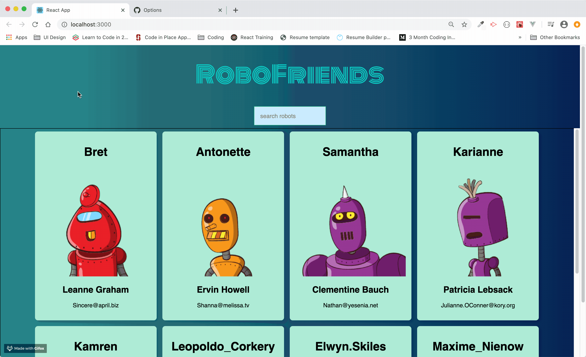

 <h3 align="center">RoboFriends</h3>
 

<!-- PROJECT LOGO -->
 

  
  </a>
  

    A basic React app that renders a list of Robots with data loaded from an API.
     
     
    <a href="https://suarez9093.github.io/robo-friends/">View live Demo</a>
  

### Built With

- [React](https://reactjs.org/)
- [Redux](https://redux.js.org/)
- [Redux Redux](https://react-redux.js.org/)

<!-- CONTACT -->

## Contact

Alex Suarez - [LinkedIn](https://www.linkedin.com/in/alexsuarez9093/) - suarez9093@hotmail.com
